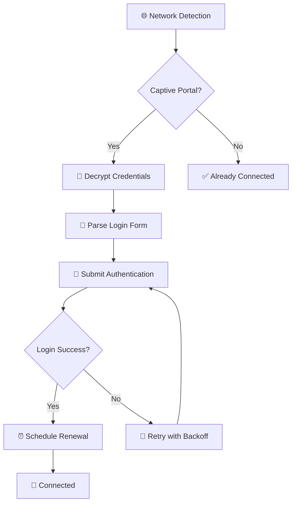

# 🌐 IITG Wi-Fi Auto-Login Extension

<div align="center">


**🚀 A modern, secure, and efficient browser extension for seamless IITG campus Wi-Fi authentication**

*Never worry about captive portal logins again!*

[🔽 Download](#-installation) • [📖 Documentation](#-features) • [🐛 Issues](https://github.com/imsahil37/autologin#/issues) • [💡 Contributing](#-contributing)

</div>

---

## ✨ Features

<table>
  <tr>
    <td align="center">
      
      <br><strong>Military-grade AES-256 encryption</strong><br>
      <sub>Your credentials are encrypted locally with unique salts</sub>
    </td>
    <td align="center">
      
      <br><strong>Intelligent network detection</strong><br>
      <sub>Automatically detects captive portals and network changes</sub>
    </td>
    <td align="center">
      
      <br><strong>Sub-second login times</strong><br>
      <sub>Optimized authentication with smart caching</sub>
    </td>
  </tr>
</table>

### 🎯 Core Features

- **🔄 Silent Auto-Login** - Seamlessly connects without user intervention
- **🛡️ Bank-Level Security** - AES-GCM encryption with PBKDF2 key derivation
- **⏱️ Proactive Renewal** - Prevents session timeouts with smart renewal
- **🎨 Material You Design** - Beautiful UI that adapts to your system theme
- **🔍 Advanced Diagnostics** - Built-in debugging tools for troubleshooting
- **📱 Responsive Interface** - Works perfectly on any screen size
- **🌙 Dark Mode Support** - Automatic light/dark theme switching
- **⚙️ Smart Retry Logic** - Exponential backoff for network failures

---

## 🚀 Installation

### Method 1: Chrome Web Store (Coming Soon)
*Extension will be available on Chrome Web Store after review*

### Method 2: Manual Installation (Developer Mode)

1. **📥 Download the Extension**
   ```bash
   git clone https://github.com/imsahil37/autologin#.git
   cd autologin#
   ```

2. **🔧 Enable Developer Mode**
   - Open Chrome/Edge → `chrome://extensions/`
   - Toggle **"Developer mode"** in the top-right corner

3. **📂 Load the Extension**
   - Click **"Load unpacked"**
   - Select the `autologin#` folder
   - Extension will appear with a Wi-Fi icon 🌐

4. **⚙️ Configure Credentials**
   - Click the extension icon
   - Go to **"Options"**
   - Enter your IITG username and password
   - Click **"Save Credentials"**
   - You're all set! 🎉

---

## 📋 Quick Start Guide

### 🔐 First Time Setup

<details>
<summary><strong>Click to expand setup instructions</strong></summary>

1. **Install the extension** following the steps above
2. **Pin to toolbar** for easy access (right-click extension icon → Pin)
3. **Open options page** and enter your IITG credentials
4. **Test the connection** using the "Force Login" button
5. **Enable auto-login** and let the extension handle everything!

> ⚠️ **Security Note**: Only use on personal devices. Never install on shared/public computers.

</details>

### 🎛️ Extension Controls

| Icon | Status | Description |
|------|--------|-------------|
| 🟢 | Connected | Successfully connected to internet |
| 🔴 | Error | Authentication failed or network error |
| ⚪ | Idle | Extension is running but inactive |
| ⏳ | Checking | Currently attempting to connect |

---

## 🏗️ Architecture

<div align="center">



</div>

### 🔧 Technical Stack

- **Frontend**: Vanilla JavaScript (ES6 Modules), HTML5, CSS3
- **Security**: Web Crypto API (AES-256-GCM encryption)
- **Storage**: Chrome Extension Storage API
- **Architecture**: Manifest V3 Service Worker
- **UI Framework**: Material You Design System

---

## 📸 Screenshots

<div align="center">

### 🎨 Beautiful Material You Interface

<table>
  <tr>
    <td align="center">
      <strong>🌟 Popup Interface</strong><br>
      <sub>Quick access to all controls</sub>
    </td>
    <td align="center">
      <strong>⚙️ Options Page</strong><br>
      <sub>Comprehensive settings and debug tools</sub>
    </td>
  </tr>
</table>

*Screenshots coming soon - the extension features a beautiful Material You design that automatically adapts to your system theme*

</div>

---

## 🔍 Advanced Features

### 🛠️ Debug Tools

Access powerful debugging tools through the options page:

```javascript
// Open browser console (F12) in options page
window.debugExtension.testEncryption()    // Test encryption system
window.debugExtension.getDebugLogs()      // View detailed logs  
window.debugExtension.forceLogin()        // Manual login test
window.debugExtension.clearAllData()      // Reset extension
```

### 📊 Monitoring & Analytics

- **Real-time status updates** with detailed diagnostics
- **Session timing information** with renewal predictions
- **Network change detection** with automatic reconnection
- **Error tracking** with specific failure reasons

### 🔒 Security Features

- **🔐 AES-256-GCM encryption** for credential storage
- **🧂 Unique salt generation** per installation
- **🔄 PBKDF2 key derivation** with 100,000 iterations
- **🛡️ No plaintext storage** - everything is encrypted
- **🚫 Auto-clear** sensitive data from memory

---

## 🚨 Troubleshooting

<details>
<summary><strong>🔧 Common Issues & Solutions</strong></summary>

### Extension Won't Load
- ✅ Check Developer Mode is enabled
- ✅ Verify all files are present in correct folders
- ✅ Check browser console for error messages

### Login Fails
- ✅ Verify credentials by logging in manually to portal
- ✅ Check if portal URL is accessible
- ✅ Use debug tools to view detailed logs

### Network Detection Issues  
- ✅ Test connectivity to `connectivitycheck.gstatic.com`
- ✅ Check extension permissions
- ✅ Temporarily disable other extensions

### Encryption Errors
- ✅ Run `window.debugExtension.testEncryption()`
- ✅ Clear all data and reconfigure if needed
- ✅ Check browser's crypto API support

</details>

---

## 🤝 Contributing

We welcome contributions! Here's how you can help:

### 🐛 Bug Reports
- Use the [issue tracker](https://github.com/imsahil37/autologin#/issues)
- Include detailed reproduction steps
- Attach debug logs when possible

### 💡 Feature Requests
- Check existing issues first
- Describe the use case clearly
- Consider implementation complexity

### 🔧 Development Setup

```bash
# Clone the repository
git clone https://github.com/imsahil37/autologin#.git

# Load in developer mode
# No build tools needed - pure vanilla JavaScript!

# Make changes and test
# Create pull request when ready
```

### 📋 Development Guidelines
- Follow existing code style and patterns
- Add comments for complex logic
- Test thoroughly on different networks
- Update documentation for new features

---

## 📄 License & Legal

### 📜 License
This project is licensed under the **MIT License** - see the [LICENSE](LICENSE) file for details.

### ⚠️ Disclaimer
- This extension is **not officially affiliated** with IIT Guwahati
- Use responsibly and in accordance with institute policies  
- Developers are not responsible for any misuse or policy violations
- Keep your credentials secure and use only on trusted devices

### 🔐 Privacy Policy
- **No data collection** - everything stays on your device
- **No analytics or tracking** - complete privacy
- **Local encryption only** - credentials never leave your browser
- **Open source transparency** - audit the code yourself

---

## 🌟 Acknowledgments

### 👏 Special Thanks
- **IIT Guwahati students** for testing and feedback
- **Open source community** for inspiration and tools
- **Material Design team** for the beautiful design system

### 🔗 Built With
- [Web Crypto API](https://developer.mozilla.org/en-US/docs/Web/API/Web_Crypto_API)
- [Chrome Extension APIs](https://developer.chrome.com/docs/extensions/)
- [Material You Design](https://m3.material.io/)

---

<div align="center">

### 💖 Made with love for the IITG community

**🌟 Star this repo if it helped you!** • **🔄 Share with friends** • **🐛 Report issues**

[](https://github.com/imsahil37/autologin#/stargazers)
[](https://github.com/imsahil37/autologin#/network)

---

**📧 Questions?** Open an [issue](https://github.com/imsahil37/autologin#/issues) • **💬 Discussion?** Start a [discussion](https://github.com/imsahil37/autologin#/discussions)

*Happy browsing! 🌐✨*

</div>
